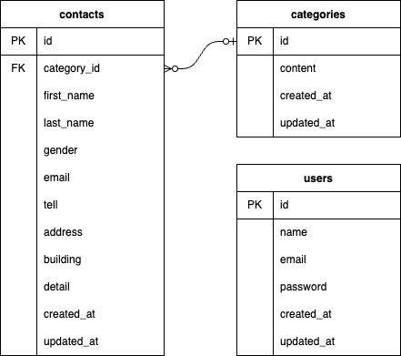

# お問い合わせフォーム

## 環境構築

### Docker ビルド

1. リポジトリをクローン

```bash
git clone https://github.com/example/contact-form.git
cd contact-form
```

2. Docker コンテナのビルドと起動

```bash
docker compose up -d --build
```

＊MySQL は、OS によって起動しない場合があるのでそれぞれの PC に合わせて `docker-compose.yml` ファイルを編集してください。

### Laravel 環境構築

1. PHP コンテナに入る

```bash
docker-compose exec php bash
```

2. `composer install`
3. `cp .env.example .env`
4. `php artisan key:generate`
5. `php artisan migrate`
6. `php artisan db:seed`

## 使用技術

- PHP 7.4.9
- Laravel 8.83.27
- MySQL 8.0.26

## ER 図



## URL

- 開発環境: [http://localhost](http://localhost)
- phpMyAdmin : [http://localhost:8080/](http://localhost:8080/)
